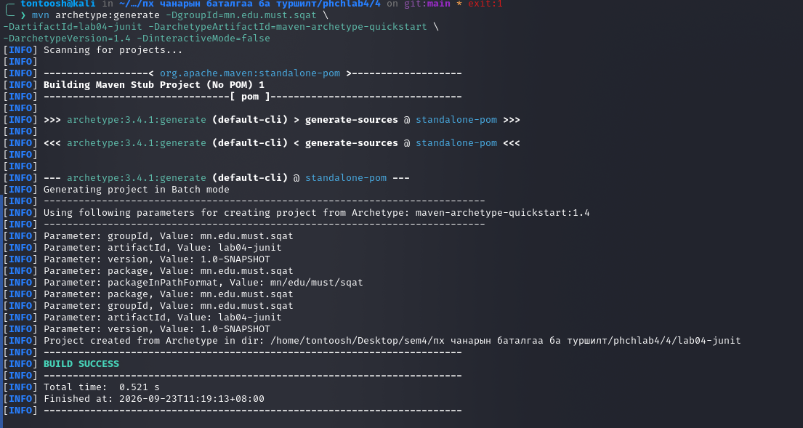
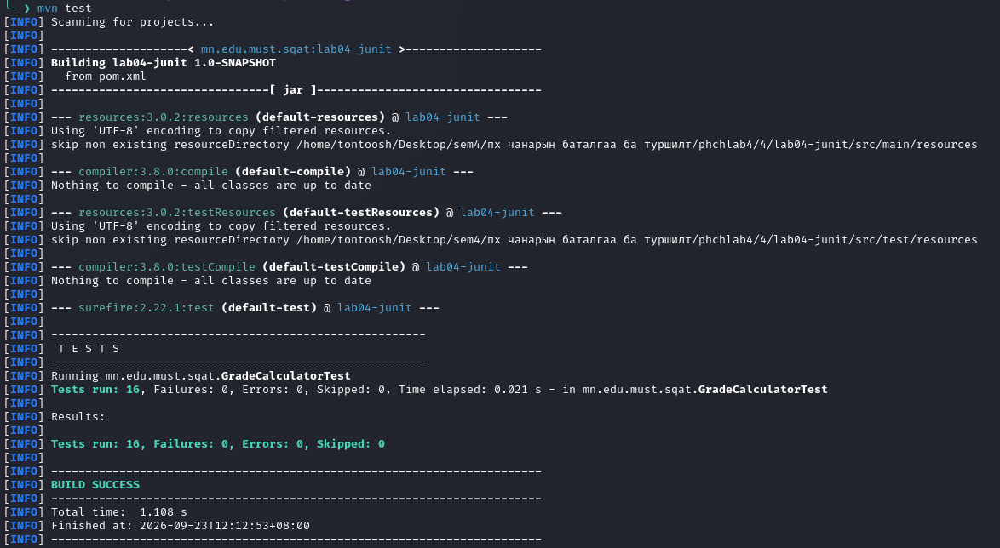
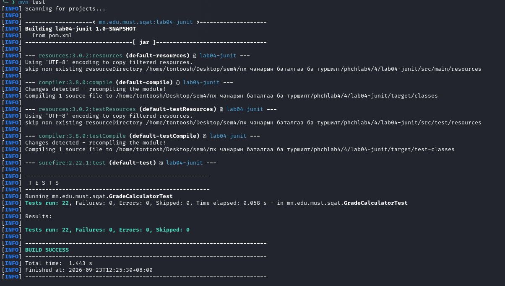

# Lab 04 — JUnit тестийн тайлан

## Оюутан

**Оюутны нэр:** Бат-Эрдэнэ Дөлгөөн
**Оюутны код:** B242270136

## Төслийн тухай

`GradeCalculator` нь оноог үсгэн дүн (`A`–`F`) болгон хувиргаж, ирц, лаборатори, сорил болон шалгалтын онооны нийлбэрийг тооцно.

- `letterGrade`: 0, 60, 70, 80, 90, 100 зэрэг хязгаарын утгуудыг шалгасан.
- `totalScore`: зөв нийлбэр, 0/100 хязгаар, сөрөг болон дээд хязгаараас давсан утгыг шалгасан.
- Хоёр методод `assertThrows`, мөн тус бүрт нь нэг `@ParameterizedTest` ашигласан.
- Нийт 14 тестийн метод, параметрчилсэн invocation-оор нийт 22 тест ажилласан.

## Ашигласан хувилбарууд

| Хэрэгсэл      | Хувилбар   |
| ------------- | ---------- |
| Java          | 21.0.11-ea |
| Apache Maven  | 3.9.12     |
| JUnit Jupiter | 5.10.2     |

## Тестийн үр дүн

Эцсийн зөв хувилбарын үр дүн: `Tests run: 22, Failures: 0, Errors: 0, Skipped: 0` болон `BUILD SUCCESS`.

- [Ногоон тестийн бүрэн гаралт — `results/mvn-test.txt`](results/mvn-test.txt)
- [Мутацийн тестийн бүрэн гаралт — `results/mvn-test-mutant.txt`](results/mvn-test-mutant.txt)

Мутацийн үед `score >= 90` нөхцөлийг зориуд `score > 90` болгосон. Үүний дараа `ninetyIsExactlyA` тест `expected: <A> but was: <B>` мэдээллээр унаж, `Failures: 1`, `BUILD FAILURE` гарсан. Дараа нь нөхцөлийг буцааж засахад бүх 22 тест ногоон болсон.

Хамгийн сонирхолтой тест нь яг 90 оноог шалгасан хязгаарын тест юм. Энэ тест мутацийн алдааг шууд илрүүлж, 90 оноо `B` болж буруу ангилагдахаас хамгаалсан.

## Ажлын явцын зураг

Maven төслийг үүсгэсэн эхний алхам:



Эхний тестийн ажиллуулалт — тухайн үеийн 16 тестийн гаралт:



Эцсийн 22 тестийн ногоон гаралт:



## Ажиллуулах команд

```bash
mvn test 2>&1 | tee results/mvn-test.txt
```
